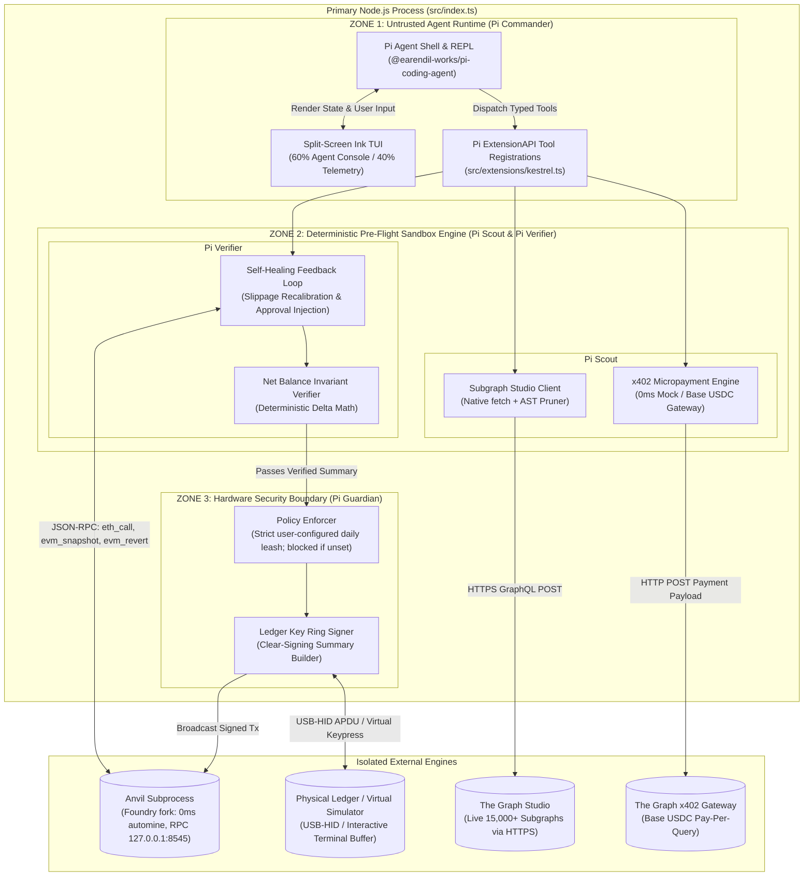
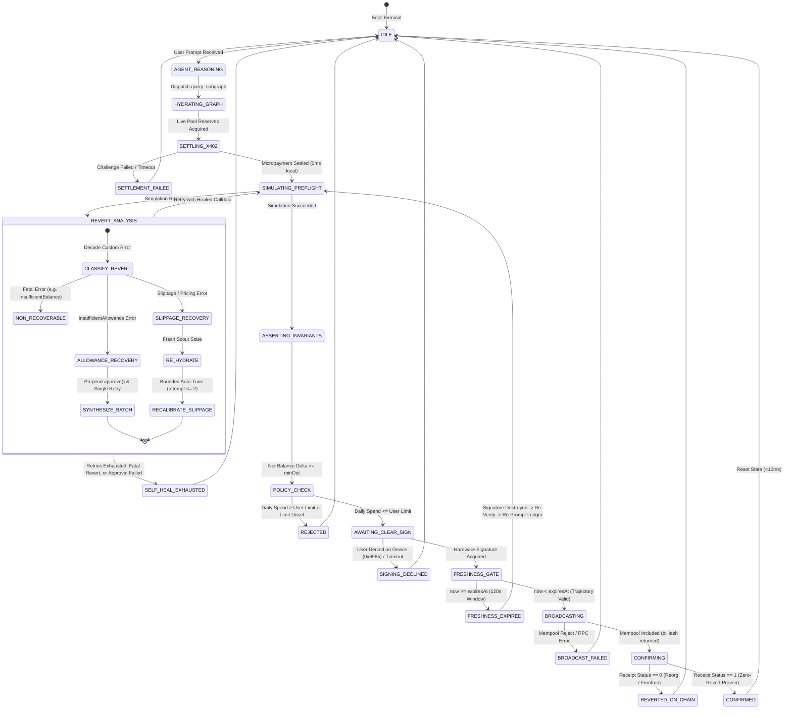

# Architecture Context: Kestrel

> **System Structure, Process Topology, System Boundaries, Invariants, and Deterministic Pipeline**

---

## 1. Stack (Lean, High-Speed, Zero-Bloat)

| Layer                          | Technology                                         | Role in Kestrel                                                                                                      |
| :----------------------------- | :------------------------------------------------- | :------------------------------------------------------------------------------------------------------------------- |
| **Agent Core & REPL**          | `@earendil-works/pi-coding-agent`                  | Interactive CLI REPL, ExtensionAPI tool registration, streaming LLM reasoning                                        |
| **Terminal UI (TUI)**          | `ink` (v4) + `react`                               | Sovereign split-screen terminal interface, ANSI telemetry cards, keyboard controls                                   |
| **EVM Engine & Cryptography**  | `viem` (v2)                                        | Strict BigInt math, ABI encoding/decoding, EIP-712 typed signing, RPC communication                                  |
| **Pre-Flight Sandbox**         | `anvil` (Foundry local child process)              | In-memory Ethereum mainnet fork, 0ms automine, atomic `evm_revert(snapshotId)`                                       |
| **On-Chain Safe Execution**    | ERC-4337 Smart Account (`KestrelSmartAccount.sol`) | Atomic multi-call batching (approve -> swap -> revoke), zero lingering allowance, on-chain invariant circuit breaker |
| **Semantic Data Client**       | Native `fetch` + `zod`                             | Zero-dependency HTTP POST client targeting Subgraph Studio GraphQL endpoints                                         |
| **Schema Pruning Pipeline**    | Custom AST/Regex Tokenizer                         | Strips GraphQL schema comments, descriptions, and unused fields (-95% token payload)                                 |
| **Micropayments (x402)**       | Native HTTP Client + `viem`                        | HTTP 402 challenge negotiation, EIP-712 payment authorization, Base USDC pay-per-query                               |
| **Hardware Boundary**          | `@ledgerhq/hw-transport-node-hid`                  | Physical Ledger Stax/Flex/Nano communication over USB-HID                                                            |
| **Virtual Hardware Simulator** | Custom Terminal Emulator                           | In-memory interactive emulator for CI/demos with terminal clear-signing button prompts                               |
| **Workspace & Multiplexer**    | `herdr` (`herdr.dev`)                              | Agent-aware terminal multiplexer supporting the Master Hybrid Layout and sidebar fleet rollups                       |
| **Runtime Type Validation**    | `zod` (v3)                                         | Strict boundary validation for tool inputs, Subgraph outputs, and calldata contracts                                 |
| **Test Runner**                | `vitest` (v1)                                      | Unit tests, self-healing regression tests, deterministic invariant assertions                                        |

---

## 2. Process Topology & Execution Model

Kestrel is **not** a distributed web crawler or asynchronous background queue. It has **no BullMQ, no Redis, no Postgres, and no lifecycle DAG**.

It operates as a **single sovereign Node.js runtime process** coordinating four in-process subagents (**Pi Commander**, **Pi Scout**, **Pi Verifier**, **Pi Guardian**) within one unified program. Zero private keys exist in process memory. The sole cryptographic root of trust is the physical Ledger Key Ring (Zone 3), where private keys remain physically isolated inside secure hardware and transactions require human visual clear-signing approval on the device screen.

Kestrel natively interfaces with **Herdr** (`herdr.dev`) when `HERDR_ENV=1` to project subagent states to Herdr's sidebar in the **Master Hybrid Layout**:



---

## 3. System Boundaries & Directory Ownership

Every directory and module in Kestrel has a single, strictly bounded architectural responsibility. Crossing boundaries requires typed Zod contracts:

| Directory / Module | Architectural Owner                                     | Allowed Dependencies                                                                       | Prohibited Actions                                                                                                                                                           |
| :----------------- | :------------------------------------------------------ | :----------------------------------------------------------------------------------------- | :--------------------------------------------------------------------------------------------------------------------------------------------------------------------------- |
| `SYSTEM.md`        | Root Agent Authority                                    | Markdown                                                                                   | Definitive identity for Pi Commander, tool schemas, and index of subagent skills.                                                                                            |
| `skills/`          | Subagent Skill Manifests                                | Markdown (`SKILL.md`)                                                                      | Specialized skill guides for `kestrel-scout`, `kestrel-verifier`, and `kestrel-guardian`.                                                                                    |
| `contracts/`       | On-Chain Safe Execution                                 | Solidity, Foundry (`forge-std`)                                                            | `KestrelSmartAccount.sol`, `KestrelAccountFactory.sol`. Native ERC-4337 smart account controlled by Ledger key. Verified via pure Solidity unit & fuzz tests (`forge test`). |
| `src/types.ts`     | Shared Contract Authority                               | `zod`, `viem`                                                                              | No network calls, no runtime state, no UI code.                                                                                                                              |
| `src/config.ts`    | Environment Validator                                   | `zod`, `dotenv`                                                                            | No hardcoded keys, no silent fallbacks for required studio keys or spend leash.                                                                                              |
| `src/cli/`         | CLI & Runtime Process Harness                           | `@earendil-works/pi-coding-agent`, `src/core/`                                             | Process wrapper (`client.ts`) and mode dispatcher (`main.ts` for interactive, rpc, print).                                                                                   |
| `src/extensions/`  | Pi ExtensionAPI Registration                            | `@earendil-works/pi-coding-agent`, `src/tools/`                                            | Registers typed tools, slash commands (`/leash`, `/reset`), and CLI flags (`--daily-leash`).                                                                                 |
| `src/core/`        | Zone 1: Subagent Fleet Orchestrator                     | `@earendil-works/pi-coding-agent`, `src/types.ts`                                          | **No access to private keys, USB-HID transport, or live broadcast.**                                                                                                         |
| `src/tools/`       | Zone 1: ExtensionAPI Dispatcher                         | `src/types.ts`, `src/graph/`, `src/x402/`, `src/sandbox/`, `src/ledger/`                   | No direct chain manipulation; dispatches strictly via typed handlers.                                                                                                        |
| `src/graph/`       | Zone 2: Subgraph Semantic Client (Scout)                | Native `fetch`, `src/types.ts`                                                             | No heavy GraphQL SDKs (`@urql/core`, `@apollo/client`), no static mocked JSON.                                                                                               |
| `src/x402/`        | Zone 2: Micropayment Engine (Scout)                     | `viem`, `src/types.ts`                                                                     | No external network round-trips in `simulation` mode (0ms local facilitator).                                                                                                |
| `src/sandbox/`     | Zone 2: Pre-Flight Simulation & Self-Healing (Verifier) | `viem`, `node:child_process`, `src/types.ts`                                               | No unhandled reverts, no skipping invariant assertions, no live broadcast.                                                                                                   |
| `src/ledger/`      | Zone 3: Hardware Security Guardian (Guardian)           | `@ledgerhq/wallet-cli`, `@ledgerhq/hw-transport-node-hid`, `ledgerhq/agent-skills`, `viem` | **Keys and raw secrets cannot leak into LLM context or logs. Uses `wallet-cli ring` broker pattern. No bypass of the user-configured daily spend policy.**                   |
| `src/telemetry/`   | Observability & Diagnostic Engine                       | `src/types.ts`, `node:fs`                                                                  | No unredacted secret logging; bounded-cardinality metrics only.                                                                                                              |
| `src/modes/`       | Runtime Mode Orchestrators (`interactive` / `headless`) | `src/core/`, `src/tui/`                                                                    | Headless mode must not mount Ink components to stdout.                                                                                                                       |
| `src/tui/`         | Presentation Layer (Ink/React)                          | `ink`, `react`, `src/types.ts`                                                             | No direct blockchain calls or private key manipulation. Display and input only.                                                                                              |

---

## 4. The Deterministic Execution Pipeline (No DAG)

Kestrel executes DeFi actions through a **strictly sequential, deterministic safety pipeline** with an in-memory self-healing loop and hardened failure/freshness gates.



### Pipeline Transition Specifications

| State                  | Subagent Authority      | Herdr Signal          | Entry Condition                                     | Exact Action Taken                                                                                                                                                                                                                                                                                                     | Exit Condition / Next State                                                                                  | Timeout / SLA               |
| :--------------------- | :---------------------- | :-------------------- | :-------------------------------------------------- | :--------------------------------------------------------------------------------------------------------------------------------------------------------------------------------------------------------------------------------------------------------------------------------------------------------------------- | :----------------------------------------------------------------------------------------------------------- | :-------------------------- |
| `IDLE`                 | Pi Commander            | `idle`                | Process boot or prior run complete                  | Displays prompt `kestrel ❯`, renders status pills                                                                                                                                                                                                                                                                      | User submits natural language prompt                                                                         | Instant                     |
| `AGENT_REASONING`      | Pi Commander            | `working`             | User prompt received                                | Generates correlation ID (`corr_${string}`), builds execution plan & dispatches subagents                                                                                                                                                                                                                              | Tool call payload validated via Zod                                                                          | < 2.0s                      |
| `HYDRATING_GRAPH`      | Pi Scout                | `working`             | `query_subgraph` tool invoked                       | Native `fetch` query to Subgraph Studio + AST schema pruner                                                                                                                                                                                                                                                            | Returns pool reserves, tick depth, and TVL                                                                   | < 250ms (live)              |
| `SETTLING_X402`        | Pi Scout                | `working`             | Data payload challenge returned                     | Negotiate HTTP 402 challenge via EIP-712 / Base USDC gateway                                                                                                                                                                                                                                                           | Succeeded: -> `SIMULATING_PREFLIGHT`<br>Failed / Timeout: -> `SETTLEMENT_FAILED`                             | < 1ms (sim) / < 1.5s (live) |
| `SETTLEMENT_FAILED`    | Pi Scout                | `failed`              | Micropayment rejected or relayer timed out          | Emits settlement error diagnostic with correlation ID                                                                                                                                                                                                                                                                  | Aborts pipeline cleanly: -> `IDLE`                                                                           | < 10ms                      |
| `SIMULATING_PREFLIGHT` | Pi Verifier             | `working`             | Calldata constructed or re-verified                 | Takes snapshot (`evm_snapshot`); executes `simulate_preflight()`                                                                                                                                                                                                                                                       | Success: -> `ASSERTING_INVARIANTS`<br>Revert: -> `REVERT_ANALYSIS`                                           | < 5ms (local fork)          |
| `REVERT_ANALYSIS`      | Pi Verifier             | `working`             | Custom error caught                                 | Rollback (`evm_revert`), classify error:<br>1. **Allowance Error:** Synthesizes atomic `[approve, swap]` multi-call batch (max 1 retry, no Scout query)<br>2. **Slippage Error:** Re-hydrates pool state from Scout & recalibrates (+0.50% bump up to 200 bps, max 2 retries)<br>3. **Fatal Error:** Halts immediately | Retrying: -> `SIMULATING_PREFLIGHT`<br>Exhausted / Fatal: -> `SELF_HEAL_EXHAUSTED`                           | < 5ms                       |
| `SELF_HEAL_EXHAUSTED`  | Pi Verifier             | `failed`              | Retry budget spent or non-recoverable error         | Emits `SelfHealingExhaustedError`, `ApprovalInjectionFailedError`, or fatal revert diagnostic                                                                                                                                                                                                                          | Aborts to operator with full stack trace: -> `IDLE`                                                          | < 10ms                      |
| `ASSERTING_INVARIANTS` | Pi Verifier             | `working`             | EVM call succeeded                                  | Verifies $\Delta B_{token} \ge minOut$; computes `calldataHash` and `expiresAt` (now + 120s)                                                                                                                                                                                                                           | Invariant valid: -> `POLICY_CHECK`                                                                           | < 1ms                       |
| `POLICY_CHECK`         | Pi Guardian             | `working`             | Invariants verified                                 | Check daily spend ledger: `current + tx <= userLimit` (unconditionally rejects if limit unset)                                                                                                                                                                                                                         | Within limit: -> `AWAITING_CLEAR_SIGN`<br>Exceeded / Unset: -> `REJECTED`                                    | < 1ms                       |
| `AWAITING_CLEAR_SIGN`  | Pi Guardian             | **`blocked`** (Alert) | Policy check passed                                 | Asserts `sha256(calldata) === trajectory.calldataHash`; formats clear-sign summary; prompts device; reports `blocked` semantic state to Herdr                                                                                                                                                                          | Signature received: -> `FRESHNESS_GATE`<br>User Denied (0x6985) / Timeout: -> `SIGNING_DECLINED`             | User-gated                  |
| `SIGNING_DECLINED`     | Pi Guardian             | `idle`                | Operator pressed reject on device or timeout        | Emits `SigningDeclined` diagnostic with correlation ID                                                                                                                                                                                                                                                                 | Aborts pipeline cleanly without error cascade: -> `IDLE`                                                     | < 10ms                      |
| `FRESHNESS_GATE`       | Pi Guardian             | `working`             | Signature acquired                                  | Asserts `Date.now() < trajectory.expiresAt` (120s window)                                                                                                                                                                                                                                                              | Fresh: -> `BROADCASTING`<br>Expired: -> `FRESHNESS_EXPIRED`                                                  | < 1ms                       |
| `FRESHNESS_EXPIRED`    | Pi Guardian             | `working`             | Signing delayed past 120s freshness window          | Destroys signed bytecode from memory; emits `FreshnessExpiredError`; invalidates trajectory                                                                                                                                                                                                                            | Routes back to fast re-verification: -> `SIMULATING_PREFLIGHT` (Mandates fresh clear-signing loop on device) | < 10ms                      |
| `BROADCASTING`         | Pi Guardian / Commander | `working`             | Hardware signature generated and freshness verified | Submits raw signed bytecode to chain RPC node                                                                                                                                                                                                                                                                          | Accepted (txHash returned): -> `CONFIRMING`<br>Rejected (RPC error): -> `BROADCAST_FAILED`                   | RPC round-trip              |
| `BROADCAST_FAILED`     | Pi Commander            | `failed`              | RPC rejected mempool admission                      | Emits broadcast error diagnostic with correlation ID                                                                                                                                                                                                                                                                   | Aborts pipeline: -> `IDLE`                                                                                   | < 10ms                      |
| `CONFIRMING`           | Pi Commander            | `working`             | Transaction in mempool                              | Watches transaction receipt via `watch_transaction_receipt(txHash)`                                                                                                                                                                                                                                                    | Status 1: -> `CONFIRMED`<br>Status 0 (On-chain revert): -> `REVERTED_ON_CHAIN`                               | Block time                  |
| `REVERTED_ON_CHAIN`    | Pi Commander            | `failed`              | Transaction mined with status 0 (reorg/frontrun)    | Emits emergency diagnostic and on-chain revert reason                                                                                                                                                                                                                                                                  | Alerts operator: -> `IDLE`                                                                                   | < 10ms                      |
| `CONFIRMED`            | Pi Commander            | `done` -> `idle`      | Tx confirmed on chain (Status 1)                    | Displays confirmation badge & transaction hash in console; resets state in <10ms                                                                                                                                                                                                                                       | Ready for next user prompt: -> `IDLE`                                                                        | < 10ms                      |

---

## 5. Storage & Persistence Model

Unlike Flank, Kestrel requires **no external databases (no Postgres, no Redis, no Cloudflare R2)**. All authoritative runtime state is managed locally:

1. **In-Memory Fork State (`Anvil`):**  
   Managed via JSON-RPC snapshot IDs (`evm_snapshot` and `evm_revert`). State resets execute in `< 10ms` without restarting the process.
2. **Local Spend Policy Ledger (`.kestrel/policy-ledger.json`):**  
   Persists daily spending across runs. If the user has not configured a daily limit, `dailyLimitUsd` is `null` and all autonomous writes are blocked:
   ```json
   {
     "date": "2026-09-05",
     "totalSpendUsd": 0.042,
     "dailyLimitUsd": 10.0,
     "transactions": [{ "txHash": "0x...", "amountUsd": 0.012, "timestamp": 1757034900 }]
   }
   ```
3. **Session Cache (`LRU` in-memory):**  
   Caches Subgraph queries for 30 seconds to prevent spamming Studio endpoints during rapid self-healing cycles.
4. **Structured Run-Logs (`.kestrel/runs/<executionId>.ndjson`):**  
   Records single-line machine-readable JSON telemetry events per execution for post-mortem debugging and verification. All sensitive keys, mnemonic seeds, and auth headers are automatically sanitized at the logger boundary.

---

## 6. System Invariants & Non-Negotiables

1. **Strict Zero-Revert Invariant:** No transaction is ever submitted for signing or broadcast if it failed in the pre-flight simulation sandbox.
2. **Physical / Virtual Clear-Signing Gate:** Private keys never enter the LLM's context window or environment prompt. Every write transaction requires hardware button confirmation or virtual emulator approval.
3. **Autonomous Spend Leash:** The Ledger Key Ring must unconditionally reject any transaction if the user has not configured a spend leash, or if `cumulativeDailySpend + txSpend > configuredDailyLimit`. No silent default leash is permitted.
4. **Zero-Testnet Delay in Pre-Flight:** Pre-flight checks and x402 payment simulations must execute in `< 20ms` total without network stalls to public testnets.
5. **No Mocked Data for The Graph:** Kestrel must query real Subgraph Studio endpoints with an active API key (`THE_GRAPH_API_KEY`). Static JSON mock files for Subgraph responses are strictly prohibited.
6. **In-Process Subagent Delegation & Herdr Authority:** Subagents (`scout`, `verifier`, `guardian`) execute in-process within the sovereign Node.js process to maintain <10ms simulation performance and context isolation. When hosted in Herdr (`HERDR_ENV=1`), subagents report semantic states (`working`, `blocked`, `idle`) to Herdr's sidebar without spawning separate terminal windows, ensuring the unified 60/40 TUI remains the primary console.
7. **Freshness Gate & Stale Signature Destruction Invariant:** Every verified trajectory carries an `expiresAt` timestamp (120s window; configurable via `TRANSACTION_FRESHNESS_TTL_SECONDS`). If `Date.now() >= trajectory.expiresAt`, the signed bytecode MUST be immediately destroyed from memory. The pipeline must re-simulate via Pi Verifier and force a complete Phase 3 clear-signing loop on the Ledger device with fresh parameters. Stale signatures can never be broadcast or reused.
8. **Calldata Hash Integrity Invariant:** Pi Guardian independently computes `sha256(calldata)` and asserts that it identically matches `trajectory.calldataHash` certified by Pi Verifier, guaranteeing against memory corruption in transit before prompting the Ledger. Zero private keys exist in software process memory; the hardware Ledger is the sole cryptographic root of trust.
9. **Correlation Traceability Invariant:** Every subagent dispatch, simulation attempt, self-healing event, signing request, and broadcast must carry the same `ExecutionId` (`corr_${string}`) generated at Commander entry for end-to-end diagnostic tracing.
10. **Ledger Key Ring & Capability Broker Invariant:** Pi Guardian utilizes the Ledger Agent Stack (`@ledgerhq/wallet-cli ring`). Sensitive environment credentials (such as `THE_GRAPH_API_KEY`) are encrypted under keys derived from the Ledger Key Ring; the LLM agent reasoning layer (Pi Commander) holds only scoped capabilities and never raw secrets. For hosts with no physical USB port (VPS, CI runner, or developer machines), Kestrel supports `wallet-cli ring` headless enrollment alongside the interactive terminal OLED emulator, preserving device-backed trust everywhere.
